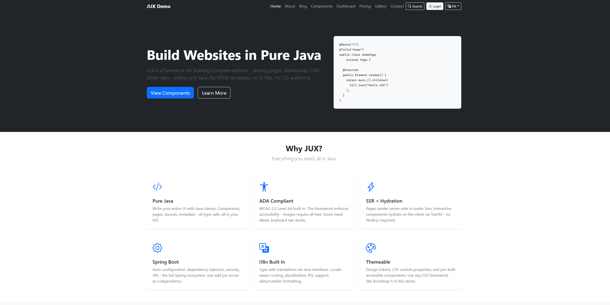
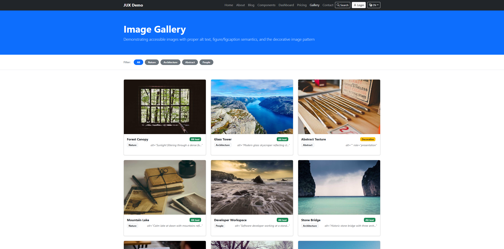
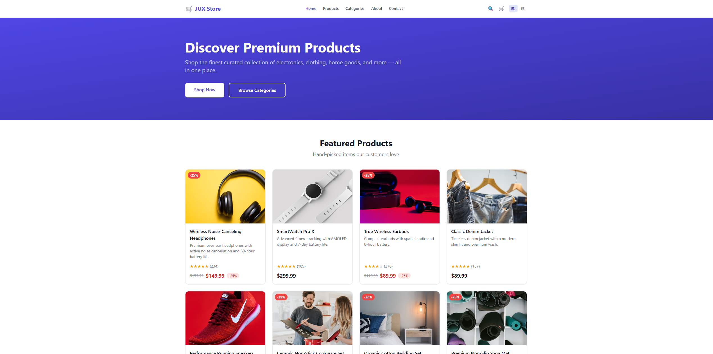
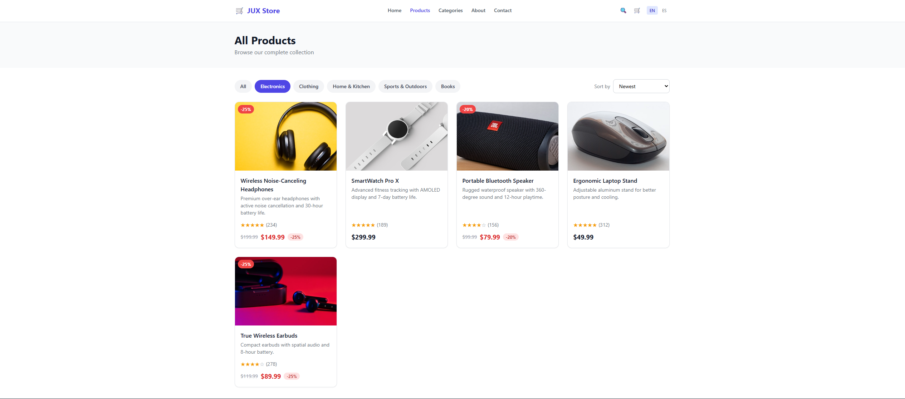
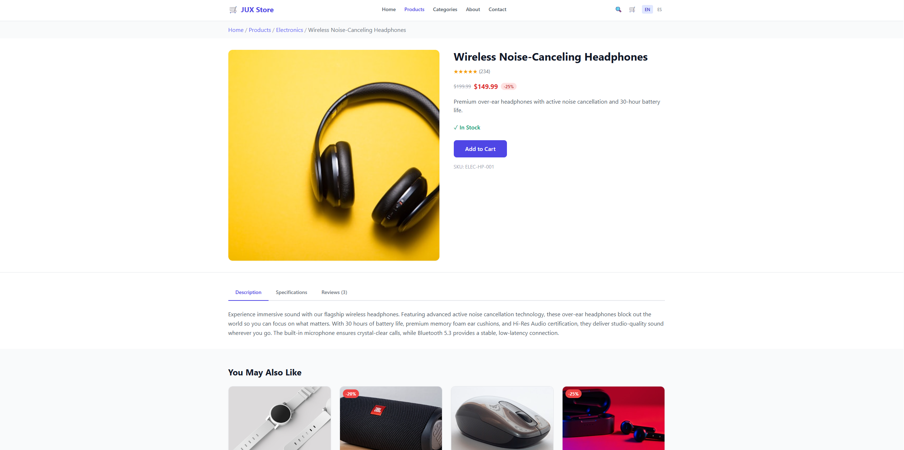
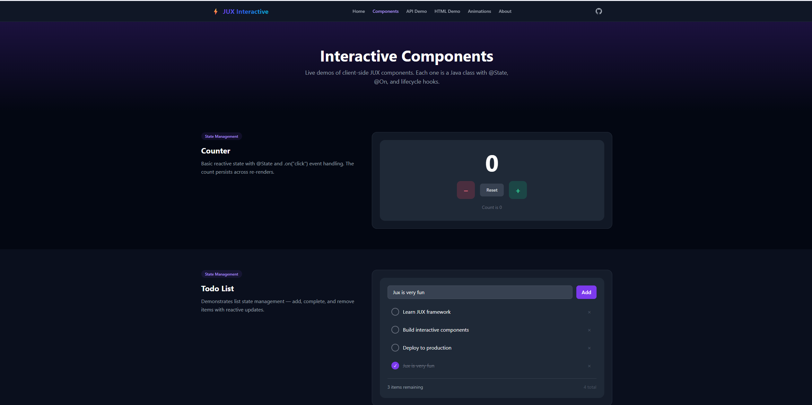
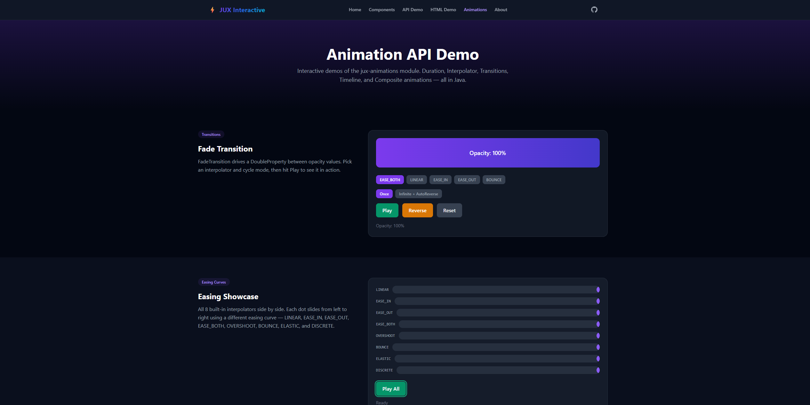

<div align="center">


### Build entire websites in pure Java.
### No HTML templates. No JavaScript files. No CSS authoring. Just Java.

**SSR** · **WCAG 2.2 AA** · **i18n** · **Themes** · **CMS** · **Reactive** · **Animations** · **Spring Boot**

[Why JUX?](#why-jux) · [Quick Start](#quick-start) · [Architecture](#architecture) · [Modules](#modules) · [Examples](#examples) · [Configuration](#configuration) · [License](#license)

</div>

---

> **JUX is a concept framework.** It was born from a simple frustration: I'm tired of juggling HTML, CSS, JavaScript, Thymeleaf, npm, webpack, and twelve other things just to build a website on Spring Boot. So I built JUX — one language, one build system, one runtime. It works. It compiles. It renders. It ships. It's not final. It will evolve.
>
> — **XDSSWAR**

---

## Why JUX?

Every Java web framework today makes you step outside Java. Thymeleaf? HTML templates with magic syntax. Vaadin? Generates JS behind your back. JSP? Dead. React + Spring? Two build systems, two languages, two mental models, and a REST API just to glue them together.

**JUX says no to all of that.**

You write Java. JUX renders HTML. Your pages are classes. Your elements are objects. Your styles are annotations. Your routes are annotations. Your i18n is type-safe interfaces. Your accessibility is enforced at the framework level. Your client-side interactivity compiles from Java to JavaScript via TeaVM.

```java
@Route("/")
@Title("Welcome")
@Css("themes/default.css")
public class HomePage extends Page {

    @Override
    public Element render() {
        return main_().children(
            h1().text("Hello from JUX"),
            p().text("Built entirely in Java. No templates. No JS. No CSS files.")
        );
    }
}
```

That's a complete page. Spring Boot auto-configuration picks up `@Route`, registers the handler, renders SSR HTML, injects CSS. No controllers. No templates. No configuration classes.

### What you get

| Feature | How it works |
|---|---|
| **Server-Side Rendering** | Component trees serialize to HTML5 — target < 5ms per page |
| **Zero HTML templates** | `Element` tree API: `div()`, `h1()`, `section()`, `nav()` — all Java |
| **Zero JS authoring** | Client interactivity via TeaVM — Java compiles to JS, DOM access via `org.teavm.jso.dom.html` |
| **Zero CSS files** | Theme system with design tokens, CSS variables, dark mode — generated from Java config |
| **WCAG 2.2 AA by default** | No `img()` without alt text. Audit engine catches violations at render time. ADA compliance built in. |
| **Type-safe i18n** | Translations are Java interfaces, not `.properties` files. Compile-time safety. |
| **Cookie-based themes** | Light/dark switching without page reload — `data-theme` attribute + CSS selectors |
| **Reactive properties** | Optional — observable values, bindings, computed expressions, observable collections |
| **Animations** | Optional — keyframe timelines, transitions (fade, scale, slide, rotate), easing functions |
| **HTML templates** | Optional — load HTML files into components via `@Html`, `@HtmlId`, `@Slot` annotations |
| **Route engine** | `@Route("/blog/{slug}")` with typed path params, query params, security roles, caching |
| **Spring Boot native** | Auto-configuration, DI, JPA, Security — all the Spring ecosystem, zero friction |
| **CMS module** | Database-driven pages, widget registry, drag-and-drop admin panel |

### Screenshots

**JUX Demo** — Bootstrap 5, light/dark themes, i18n





**JUX Store** — Tailwind CSS, e-commerce storefront







**Client-Side Demo** — TeaVM interactive components & animations





---

## Quick Start

### 1. Add JUX to your Spring Boot project

```groovy
// build.gradle
plugins {
    id 'java'
    id 'org.springframework.boot' version '3.5.10'
    id 'io.spring.dependency-management' version '1.1.7'
}

dependencies {
    implementation 'xss.it.jux:jux-server:1.0.0'
    implementation 'xss.it.jux:jux-themes:1.0.0'      // optional: theme components
    implementation 'xss.it.jux:jux-cms:1.0.0'          // optional: CMS module
    implementation 'xss.it.jux:jux-reactive:1.0.0'     // optional: reactive properties & collections
    implementation 'xss.it.jux:jux-animations:1.0.0'   // optional: keyframe animations & transitions
    implementation 'xss.it.jux:jux-html:1.0.0'         // optional: HTML template loading
}
```

### 2. Create your application

```java
@SpringBootApplication
@Css(value = "/css/styles.css", order = 1)
@Favicon(value = "/img/favicon.png", type = "image/png")
public class MyApp implements WebApplication {
    public static void main(String... args) {
        SpringApplication.run(MyApp.class, args);
    }
}
```

The `WebApplication` interface marks your main class as a JUX application. `@Css`, `@Js`, and `@Favicon` declared here apply to **every page** automatically — no need to repeat them.

### 3. Create a page

```java
package com.example.pages;

import xss.it.jux.annotation.*;
import xss.it.jux.core.*;
import static xss.it.jux.core.Elements.*;

@Route("/")
@Title("Home")
public class HomePage extends Page {

    @Override
    public Element render() {
        return main_().children(
            h1().text("It works."),
            p().text("Your first JUX page.")
        );
    }
}
```

### 4. Configure

```yaml
# application.yml
jux:
  base-package: com.example.pages
```

### 5. Run

```bash
./gradlew bootRun
```

Open `http://localhost:909X`. Done. (Check each demo application.yml file for the port)

---

## Architecture

```
┌──────────────────────────────────────────────────────────────────────┐
│                         Consumer Project                             │
│  @Route pages · @JuxComponent widgets · @MessageBundle i18n          │
├──────────────────────────────────────────────────────────────────────┤
│                                                                      │
│  ┌─────────────┐  ┌─────────────┐  ┌──────────────────────────────┐ │
│  │  jux-server  │  │  jux-themes │  │          jux-cms             │ │
│  │  SSR engine  │  │  Components │  │  Page builder, widgets       │ │
│  │  Route engine│  │  Design     │  │  Admin panel                 │ │
│  │  Spring auto │  │  tokens     │  │  Widget registry             │ │
│  └──────┬───┬──┘  └──────┬──────┘  └───────────┬──────────────────┘ │
│         │   │            │                      │                    │
│  ┌──────┴───┴────────────┴──────────────────────┘                    │
│  │                                                                   │
│  │  ┌───────────┐  ┌───────────┐  ┌─────────────┐                   │
│  │  │  jux-core │  │  jux-a11y │  │   jux-i18n  │                   │
│  │  │  Element  │  │  WCAG 2.2 │  │  Messages   │                   │
│  │  │  PageMeta │  │  Audit    │  │  Locale     │                   │
│  │  │  Page     │  │  AutoFix  │  │  RTL        │                   │
│  │  └─────┬─────┘  └───────────┘  └─────────────┘                   │
│  │        │                                                          │
│  │  ┌─────┴──────────────┐  ┌──────────────┐                        │
│  │  │  jux-annotations   │  │ jux-processor │                        │
│  │  │  @Route @Css @Title│  │ Compile-time  │                        │
│  │  │  @Meta @Js @Layout │  │ validation    │                        │
│  │  └────────────────────┘  └──────────────-┘                        │
│  │                                                                   │
│  │  ┌─────────────┐                                                  │
│  │  │ jux-client  │  TeaVM: Java → JavaScript                        │
│  │  │ DOM bridge  │  Hydration, state, events                        │
│  │  │ Event bind  │  org.teavm.jso.dom.html.*                        │
│  │  └─────────────┘                                                  │
│  │                                                                   │
│  │  ┌────────────────────────────────────────────────────────────┐   │
│  │  │                  OPTIONAL MODULES                          │   │
│  │  │                                                            │   │
│  │  │  ┌──────────────┐  ┌────────────────┐  ┌──────────────┐   │   │
│  │  │  │ jux-reactive │  │ jux-animations │  │   jux-html   │   │   │
│  │  │  │ Properties   │  │ Timeline       │  │ @Html parse  │   │   │
│  │  │  │ Bindings     │  │ Keyframes      │  │ @HtmlId      │   │   │
│  │  │  │ Collections  │  │ Transitions    │  │ @Slot inject │   │   │
│  │  │  │ Expressions  │  │ Interpolators  │  │ #{} i18n     │   │   │
│  │  │  └──────────────┘  └────────────────┘  └──────────────┘   │   │
│  │  └────────────────────────────────────────────────────────────┘   │
│  │                                                                   │
├──┴───────────────────────────────────────────────────────────────────┤
│                        Spring Boot 3.5.10                            │
│                 Web MVC · JPA · Security · DI · Cache                │
└──────────────────────────────────────────────────────────────────────┘
```

### Request Lifecycle

```
GET /es/blog/hello-world?ref=twitter

  → DispatcherServlet
  → JuxRouteHandlerMapping     matches /blog/{slug} (@Localized)
  → Security check             @Route(roles = { ... })
  → Locale resolution          URL prefix "es" → Locale("es")
  → Theme resolution           Cookie "jux-theme" → "dark"
  → Cache check                key = path + query + locale + theme
  → Page instantiation         Spring DI (services via constructor injection)
  → Request init               pathParams, messages, context injected into Page
  → Parameter injection        @PathParam slug, @QueryParam ref
  → pageMeta()                 Dynamic title, OG tags, redirects
  → Metadata merge             Annotations + programmatic, dedup
  → render()                   Element tree → HTML5 string
  → Accessibility audit        WCAG 2.2 AA (dev mode)
  → Cache store                Caffeine TTL
  → Response                   text/html, data-theme, lang, dir
```

---

## Core Concepts

### Page vs Component

JUX has two base classes with a clear separation of concerns:

| | `Component` | `Page` |
|---|---|---|
| **Purpose** | Reusable UI building blocks | Routable views with `@Route` |
| **Methods** | `render()` | `render()` + `pageMeta()` + request access |
| **Examples** | Navbar, Footer, Card, Modal | HomePage, BlogPostPage, SearchPage |
| **Instantiation** | `new Navbar(data)` — direct Java | Spring-managed — auto DI |
| **Request access** | No (receives data via constructor) | Yes — `pathParam()`, `queryParam()`, `messages()`, `locale()`, `context()` |

**`Component`** — a pure UI building block. Only has `render()`. No request awareness. Data flows in through the constructor:

```java
public class ProductCard extends Component {
    private final String name;
    private final String price;

    public ProductCard(String name, String price) {
        this.name = name;
        this.price = price;
    }

    @Override
    public Element render() {
        return article().cls("card").children(
            h3().text(name),
            span().cls("price").text(price)
        );
    }
}
```

**`Page`** — a routable view. Has `pageMeta()` for metadata, plus built-in access to the entire request lifecycle:

```java
@Route("/products/{id:long}")
@Title("Product")
public class ProductPage extends Page {

    @PathParam private long id;
    private final ProductService products;

    public ProductPage(ProductService products) {  // Spring injects this
        this.products = products;
    }

    @Override
    public PageMeta pageMeta() {
        var product = products.findById(id);
        return PageMeta.create()
            .title(product.getName())
            .ogImage(product.getImage())
            .htmlLang(locale().getLanguage());
    }

    @Override
    public Element render() {
        var product = products.findById(id);
        return main_().children(
            new ProductCard(product.getName(), product.getPrice()).render(),
            p().text(messages().getString("product.details"))
        );
    }
}
```

Notice: **no `@Autowired` needed.** Pages are Spring beans — constructor injection works automatically with Spring Boot 3.x. And `messages()`, `locale()`, `pathParam()` are inherited from `Page`, not injected.

### Composing Components

Components are plain Java objects. Compose them with `new` and call `.render()`:

```java
@Route("/about")
@Title("About Us")
public class AboutPage extends Page {

    @Override
    public Element render() {
        return new PageLayout("/about", messages(), aboutContent()).render();
    }

    private Element aboutContent() {
        return section().children(
            h1().text("About Us"),
            p().text("We build things with Java.")
        );
    }
}
```

```java
public class PageLayout extends Component {
    private final String activePath;
    private final JuxMessages messages;
    private final Element content;

    public PageLayout(String activePath, JuxMessages messages, Element content) {
        this.activePath = activePath;
        this.messages = messages;
        this.content = content;
    }

    @Override
    public Element render() {
        return div().cls("page").children(
            skipNav("main-content", "Skip to main content"),
            new Navbar(activePath, messages).render(),
            main_().id("main-content").children(content),
            new Footer(messages).render()
        );
    }
}
```

Data flows **down** through constructors. No magic injection. No global state. Just Java.

---

## Modules

### `jux-annotations` — Zero-dependency annotation library

All the annotations that power the framework. No runtime dependencies.

```java
@Route("/blog/{slug}")          // URL mapping with typed params
@Title("#{blog.title}")         // Page title (supports i18n keys)
@Css("pages/blog.css")          // CSS resources
@Js(value = "chart.js", defer = true)  // JS resources
@Meta(name = "robots", content = "index,follow")
@Layout(MainLayout.class)       // Wrapping layout component
@Localized                      // Auto locale-prefixed URLs
@Favicon("/favicon.ico")        // Favicon
@Canonical                      // SEO canonical URL
```

Parameter injection (on `Page` fields):

```java
@PathParam private String slug;           // /blog/{slug}
@QueryParam(defaultValue = "1") int page; // ?page=2
@HeaderParam("Accept-Language") String lang;
@CookieParam("session-id") String session;
@SessionParam("cart") ShoppingCart cart;
@RequestContext JuxRequestContext ctx;     // Full request access
@LocaleParam Locale locale;               // Resolved locale
```

Client-side lifecycle:

```java
@JuxComponent(clientSide = true)  // Compiles to JS via TeaVM
@State private int count = 0;     // Reactive — triggers re-render
@On("click") void handle(...);    // DOM event binding
@OnMount void init();             // After hydration
@OnUnmount void cleanup();       // Before removal
```

---

### `jux-core` — The heart of JUX

**`Component`** — Base class for reusable UI building blocks:

```java
public abstract class Component {
    public abstract Element render();  // Build the UI tree
}
```

**`Page`** — Base class for routable pages (extends Component):

```java
public abstract class Page extends Component {
    public PageMeta pageMeta() { ... }     // Optional dynamic metadata

    // Built-in request access — no injection needed
    protected String pathParam(String name) { ... }
    protected String queryParam(String name) { ... }
    protected JuxMessages messages() { ... }
    protected Locale locale() { ... }
    protected String header(String name) { ... }
    protected String cookie(String name) { ... }
    protected <T> T session(String name) { ... }
    protected boolean isPost() { ... }
    protected String formParam(String name) { ... }
    protected void status(int code) { ... }
    protected void redirect(String url) { ... }
    // ... more
}
```

**`Element`** — Virtual DOM node with fluent builder:

```java
div().id("card").cls("card", "elevated")
    .style("background", "#fff")
    .aria("label", "Product card")
    .role("article")
    .children(
        h2().text("Product Name"),
        p().text("Description here"),
        a().attr("href", "/buy").text("Buy Now")
    )
```

**`Elements`** — 65+ HTML5 factory methods:

```java
import static xss.it.jux.core.Elements.*;

// Semantic structure
header(), nav(), main_(), aside(), footer(), section(), article()

// Headings
h1(), h2(), h3(), h4(), h5(), h6()

// Text
p(), a(), strong(), em(), small(), mark(), code(), pre(), blockquote()

// Lists
ul(), ol(), li(), dl(), dt(), dd()

// Tables
table(), thead(), tbody(), tfoot(), tr(), th(), td(), caption()

// Forms
form(), input(), textarea(), select(), option(), button(), label(), fieldset()

// Media
img(src, alt), imgDecorative(src), video(), audio(), canvas(), svg(), iframe()

// Accessibility helpers
skipNav(targetId, text)     // Skip-to-content link (WCAG 2.4.1)
srOnly(text)                // Screen-reader-only text
liveRegion("polite")        // ARIA live region for dynamic content
```

> There is intentionally **no** `img()` without alt text. You cannot create an image in JUX without providing accessibility text. This is a compile-time guarantee.

**`PageMeta`** — Dynamic page metadata (returned from `Page.pageMeta()`):

```java
PageMeta.create()
    .title("Blog Post Title")
    .titleTemplate("%s | My Site")
    .description("Post excerpt for SEO")

    // OpenGraph
    .ogTitle("Title").ogImage("/img/cover.jpg").ogImageAlt("Cover photo")

    // Twitter Cards
    .twitterCard("summary_large_image").twitterSite("@myhandle")

    // Resources
    .css("vendor/prism.css", 50)
    .js("vendor/prism.js", 50)
    .removeCss("layout/sidebar.css")  // Remove layout CSS on this page

    // HTTP
    .status(404)
    .redirectTo("/new-url", 301)
    .header("X-Custom", "value")
    .cacheControl("public, max-age=3600")

    // HTML root
    .htmlLang("en").htmlDir("ltr")
    .htmlAttr("data-theme", "dark")
    .bodyClass("page-blog", "has-sidebar")

    // Structured data
    .jsonLd(articleSchemaJson)

    // Performance hints
    .preload("/fonts/Inter.woff2", "font")
    .preconnect("https://cdn.example.com")

    // Conditional
    .when(post.hasCode(), meta -> meta.css("prism.css").js("prism.js"))
```

---

### `jux-a11y` — WCAG 2.2 Level AA audit engine

Scans element trees for accessibility violations at render time. Not an afterthought — a first-class framework feature.

**Rules enforced:**

| WCAG | Rule | Severity |
|---|---|---|
| 1.1.1 | Images must have alt text | ERROR |
| 1.2.2 | Videos must have caption tracks | WARNING |
| 1.3.1 | Tables need captions, inputs need labels | ERROR |
| 1.4.4 | Font sizes must use rem/em (not px) | WARNING |
| 2.1.1 | Clickable elements must be keyboard accessible | WARNING |
| 2.4.1 | Skip navigation must be present | WARNING |
| 2.4.4 | No "click here" link text | WARNING |
| 3.1.1 | `<html lang>` must be set | ERROR |
| 4.1.1 | No duplicate IDs | ERROR |
| 4.1.2 | Proper heading hierarchy (h1 → h2 → h3) | WARNING |

```java
JuxAccessibilityEngine engine = new JuxAccessibilityEngine();
List<A11yViolation> violations = engine.audit(elementTree);

// Each violation:
// severity: ERROR | WARNING | INFO
// wcagCriterion: "1.1.1"
// rule: "img-alt"
// message: "Image missing alt text"
// elementPath: "main > section:2 > img:1"
// suggestion: "Add alt attribute with descriptive text"
```

Auto-fix for safe issues:

```java
Element fixed = engine.autoFix(elementTree);
// Adds role="presentation" to decorative images
// Converts px font sizes to rem
// Adds aria-hidden to icon-only elements
```

---

### `jux-i18n` — Type-safe internationalization

Translations are Java interfaces. Not `.properties` files. Not YAML. **Java.** Compile-time type safety — a missing translation is a compile error, not a runtime surprise.

```java
@MessageBundle
public interface HomeMessages {
    @Message("Welcome to our site")
    String welcome();

    @Message("Hello, {0}")
    String greeting(String name);

    @Message("{0,choice,0#No items|1#1 item|1<{0} items}")
    String itemCount(int count);
}

@MessageBundle @MessageLocale("es")
public interface HomeMessagesEs extends HomeMessages {
    @Override @Message("Bienvenido a nuestro sitio")
    String welcome();

    @Override @Message("Hola, {0}")
    String greeting(String name);

    @Override @Message("{0,choice,0#Sin artículos|1#1 artículo|1<{0} artículos}")
    String itemCount(int count);
}
```

Usage in pages — `messages()` is inherited from `Page`, no injection needed:

```java
@Route("/")
@Localized
public class HomePage extends Page {

    @Override
    public Element render() {
        var m = messages();                         // Built into Page
        return div().children(
            h1().text(m.getString("hero.title")),
            p().text(m.getString("greeting", "World")),
            p().text(m.getString("item.count", 5))  // "5 items" / "5 artículos"
        );
    }
}
```

Built-in locale-aware formatting:

```java
var m = messages();
m.formatDate(LocalDate.now())      // "Feb 7, 2026" / "7 feb 2026"
m.formatCurrency(29.99, "USD")     // "$29.99" / "29,99 $"
m.formatNumber(1250.5, 2)          // "1,250.50" / "1.250,50"
m.isRtl()                          // true for Arabic, Hebrew, Farsi
m.currentLocale()                  // Locale("es")
m.availableLocales()               // [en, es, fr, ...]
```

Locale resolution chain: URL prefix → `?lang=` param → cookie → session → `Accept-Language` header → default.

---

### `jux-server` — Spring Boot auto-configuration

Drop `jux-server` on your classpath. Everything wires itself.

**What gets auto-configured:**

- `JuxRenderer` — SSR engine (Element trees → HTML5)
- `JuxRouteRegistrar` — classpath scanning for `@Route` pages
- `JuxRouteHandlerMapping` — Spring MVC integration
- `JuxRouteHandler` — full request lifecycle orchestration
- `ParameterInjector` — `@PathParam`, `@QueryParam`, `@CookieParam`, etc.
- `MetadataResolver` — annotation + programmatic metadata merging
- `ResourceCollector` — CSS/JS deduplication, ordering, injection
- `SsrCache` — Caffeine-backed HTML caching
- `JuxThemeResolver` — cookie-based theme resolution
- `JuxThemeController` — `POST /api/theme` for no-reload theme switching
- `JuxLocaleResolver` — i18n locale resolution chain
- `Messages` — typed translation bundle service
- `RouteSecurityInterceptor` — `@Route(roles)` enforcement
- `JuxAccessibilityEngine` — WCAG audit on render

**Route examples:**

```java
// Static page with caching
@Route(value = "/about", cacheTtl = 3600)
@Title("About Us")

// Typed path parameters
@Route("/users/{id:long}")
@PathParam private long id;

// Search with pagination
@Route("/search")
@QueryParam(required = true) private String q;
@QueryParam(defaultValue = "1") private int page;

// Form handling (programmatic via Page methods)
@Route(value = "/contact", methods = { HttpMethod.GET, HttpMethod.POST })
// In render(): if (isPost()) { var name = formParam("name"); ... }

// Secured route
@Route(value = "/admin", roles = { "ROLE_ADMIN" })

// Profile-restricted (dev-only pages)
@Route(value = "/debug", profiles = { "dev" })

// Internationalized
@Route("/about") @Localized  // → /about, /es/about, /fr/about

// 404 catch-all
@Route(value = "/**", priority = Integer.MAX_VALUE)
```

**Theme switching without page reload:**

```java
// Server resolves theme from cookie → sets data-theme on <html>
// Client switches instantly:
fetch('/api/theme?value=dark', { method: 'POST' })
    .then(() => document.documentElement.setAttribute('data-theme', 'dark'));
```

CSS targets themes via attribute selectors:

```css
:root { --bg: #ffffff; --text: #000000; }
[data-theme="dark"] { --bg: #0a0a0a; --text: #f5f5f5; }
```

---

### `jux-themes` — Accessible UI components & design tokens

Pre-built components that are WCAG 2.2 AA compliant out of the box. Every one handles ARIA roles, keyboard navigation, and focus management correctly.

```java
import xss.it.jux.theme.*;

// Tabs — role="tablist", arrow key navigation
child(new JuxTabs(List.of(
    new JuxTabs.Tab("Overview", overviewContent),
    new JuxTabs.Tab("Details", detailsContent)
)))

// Accordion — aria-expanded, Enter/Space toggle
child(new JuxAccordion(List.of(
    new JuxAccordion.Section("FAQ 1", answer1),
    new JuxAccordion.Section("FAQ 2", answer2)
)))

// Modal — role="dialog", focus trap, Escape to close
child(new JuxModal("Confirm Delete", confirmContent))

// Toast — role="alert", aria-live="assertive"
child(new JuxToast("Saved successfully", JuxToast.Type.SUCCESS))

// Dropdown — aria-haspopup, arrow keys, role="menu"
child(new JuxDropdown("Actions", menuItems))

// Breadcrumb — nav aria-label, aria-current="page"
child(new JuxBreadcrumb(List.of("Home", "Blog", "Post Title")))

// Pagination — nav, aria-current, aria-disabled
child(new JuxPagination(currentPage, totalPages, "/blog?page="))

// Text field — label, aria-required, aria-invalid, aria-describedby
child(new JuxTextField("email", "Email Address"))

// Progress bar — role="progressbar", aria-valuenow/min/max
child(new JuxProgress(75, "Upload progress"))

// Skip links — visible on focus, WCAG 2.4.1
child(new JuxSkipLinks())
```

**Design tokens** — CSS variables generated from Java:

```java
DesignTokens.generateCssVariables(themeProperties)
// Outputs both light and dark mode:
//   :root { --jux-color-primary: #3b82f6; ... }
//   [data-theme="dark"] { --jux-color-primary: #60a5fa; ... }
```

---

### `jux-cms` — Database-driven pages & widget system

Build pages at runtime from the database. No recompilation needed.

**Concepts:**

- **`PageDefinition`** — a page stored in the database with slug, layout, per-locale content
- **`WidgetInstance`** — a widget placed on a page with type, props, styling, and a11y config
- **`WidgetRegistry`** — central catalog of available widget types
- **`PropSchema`** — describes what props each widget accepts (for admin panel form generation)

**Register custom widgets:**

```java
@Configuration
public class MyWidgets {
    @Bean
    public WidgetRegistration heroWidget(WidgetRegistry registry) {
        return registry.register("hero",
            HeroWidget.class,
            "Hero Banner",
            "image",
            WidgetCategory.HERO,
            PropSchema.builder()
                .prop("heading", PropType.STRING, "Main heading", true)
                .prop("ctaText", PropType.STRING, "Button label", false)
                .prop("ctaUrl", PropType.URL, "Button link", false)
                .build()
        );
    }
}
```

**Widget styling (database-stored):**

```json
{
  "id": "hero-1",
  "type": "hero",
  "props": { "heading": "Welcome", "ctaText": "Get Started", "ctaUrl": "/signup" },
  "style": {
    "background": { "type": "GRADIENT", "gradientCss": "linear-gradient(135deg, #667eea, #764ba2)" },
    "padding": "6rem 2rem",
    "minHeight": "80vh"
  },
  "a11y": { "ariaLabel": "Hero banner", "role": "banner" }
}
```

---

### `jux-reactive` — Observable properties & collections *(optional)*

A reactive data layer for JUX. **Not required** — JUX works without it. Add it when you need observable state, data binding, or computed values.

```groovy
implementation 'xss.it.jux:jux-reactive:1.0.0'
```

**Properties** — type-safe, change-tracking wrappers:

```java
var name = new SimpleStringProperty("Alice");
var age = new SimpleIntegerProperty(30);

// Listen for changes
name.addListener((obs, oldVal, newVal) ->
    System.out.println("Name changed: " + oldVal + " → " + newVal));

name.set("Bob");  // triggers listener
```

**Bindings** — computed values that auto-update:

```java
var firstName = new SimpleStringProperty("Jane");
var lastName = new SimpleStringProperty("Doe");

// Computed binding — updates automatically when either property changes
StringBinding fullName = Bindings.concat(firstName, " ", lastName);
fullName.get();  // "Jane Doe"

firstName.set("John");
fullName.get();  // "John Doe"
```

**Observable collections** — lists, sets, maps with change tracking:

```java
ObservableList<String> items = JuxCollections.observableArrayList();

items.addListener((ListChangeListener<String>) change -> {
    while (change.next()) {
        if (change.wasAdded()) System.out.println("Added: " + change.getAddedSubList());
        if (change.wasRemoved()) System.out.println("Removed: " + change.getRemoved());
    }
});

items.addAll("Alpha", "Beta", "Gamma");

// Filtered and sorted views — live, no copying
FilteredList<String> filtered = new FilteredList<>(items, s -> s.startsWith("A"));
SortedList<String> sorted = new SortedList<>(items, Comparator.reverseOrder());
```

**What's included:**
- `SimpleObjectProperty<T>`, `SimpleStringProperty`, `SimpleIntegerProperty`, `SimpleLongProperty`, `SimpleDoubleProperty`, `SimpleBooleanProperty`
- `ReadOnlyObjectProperty<T>` and typed read-only variants
- `ObjectBinding<T>`, `StringBinding`, `IntegerBinding`, `LongBinding`, `DoubleBinding`, `BooleanBinding`
- `Bindings` utility — `add`, `subtract`, `multiply`, `divide`, `concat`, `equal`, `greaterThan`, `when/then/otherwise`, and more
- `ObservableList<E>`, `ObservableSet<E>`, `ObservableMap<K,V>` with `FilteredList`, `SortedList`
- Bidirectional binding, lazy evaluation, invalidation listeners

---

### `jux-animations` — Keyframe animations & transitions *(optional)*

Timeline-based animation engine for JUX. **Not required** — add it when you need property animations, transitions, or sequenced effects.

Depends on `jux-reactive` (animates reactive properties).

```groovy
implementation 'xss.it.jux:jux-animations:1.0.0'
```

**Timeline** — keyframe-based animation:

```java
var opacity = new SimpleDoubleProperty(0.0);

Timeline timeline = new Timeline(
    new KeyFrame(Duration.ZERO,
        new KeyValue<>(opacity, 0.0)),
    new KeyFrame(Duration.seconds(1),
        new KeyValue<>(opacity, 1.0, Interpolator.EASE_IN_OUT))
);

timeline.play();  // opacity animates 0 → 1 over 1 second
```

**Built-in transitions:**

```java
// Fade in/out
new FadeTransition(Duration.millis(500), opacityProp)
    .setFromValue(0.0).setToValue(1.0).play();

// Scale
new ScaleTransition(Duration.seconds(0.3), scaleProp)
    .setFromValue(0.8).setToValue(1.0).play();

// Slide
new SlideTransition(Duration.millis(400), xProp)
    .setFromValue(-100).setToValue(0).play();

// Rotate
new RotateTransition(Duration.seconds(1), angleProp)
    .setFromValue(0).setToValue(360).play();

// Compose — parallel or sequential
new SequentialTransition(fadeIn, pause, slideOut).play();
new ParallelTransition(fadeIn, scaleUp).play();
```

**Features:**
- `Duration` — immutable time values (`ZERO`, `INDEFINITE`, `millis()`, `seconds()`, `minutes()`)
- `Interpolator` — built-in easings: `LINEAR`, `EASE_IN`, `EASE_OUT`, `EASE_IN_OUT`, `DISCRETE`
- Cycle control — repeat count, auto-reverse, rate scaling
- Status tracking — `STOPPED`, `RUNNING`, `PAUSED` with observable status property
- `FrameScheduler` — pluggable frame callback (maps to `requestAnimationFrame` on web)
- `TestFrameScheduler` — deterministic time control for unit tests

---

### `jux-html` — HTML template loading *(optional)*

Load external HTML files into JUX components. **Not required** — JUX works purely with the Java `Element` API. Add it when you prefer writing markup in HTML files with Java-powered wiring.

```groovy
implementation 'xss.it.jux:jux-html:1.0.0'
```

**Define a template:**

```html
<!-- src/main/resources/templates/pages/profile.html -->
<section class="profile">
  <h2 id="title">#{profile.title}</h2>
  <div id="avatar"></div>
  <div data-slot="content"></div>
</section>
```

**Wire it to a component:**

```java
@Html("pages/profile.html")
public class ProfileCard extends Component {

    @HtmlId private Element title;    // injected by id="title"
    @HtmlId private Element avatar;   // injected by id="avatar"
    @Slot("content") private Element content;  // injected by data-slot="content"

    @Override
    public Element render() {
        return HtmlLoader.load(this);  // parses, caches, injects, returns wired template
    }
}
```

**Features:**
- `@Html(path)` — associates a component with an HTML template file
- `@HtmlId` — injects elements by their HTML `id` attribute
- `@Slot(name)` — injects named slots (`data-slot="..."`) for dynamic content
- `HtmlParser` — full HTML5 parser (handles void elements, character entities, boolean attributes)
- `TemplateCache` — LRU cache of parsed templates (parse once, clone per use)
- `ExpressionResolver` — evaluates `#{...}` placeholders for i18n keys
- `I18nResolver`, `FormatResolver`, `FormatDirective` — locale-aware formatting in templates
- Error reporting with filename + line number

---

### `jux-processor` — Compile-time validation

Annotation processor that catches errors at compile time:

- `@Route` path syntax validation
- `@Message` pattern syntax validation
- Missing `@MessageLocale` implementations
- Duplicate route paths

### `jux-client` — TeaVM client-side hydration

Compiles Java to JavaScript via TeaVM 0.13.x. Client-side components get:

- DOM hydration from server-rendered HTML
- Reactive `@State` fields — changes trigger re-render + DOM diff/patch
- Event binding via `@On` annotations
- Direct DOM access via `org.teavm.jso.dom.html.*`

```java
@JuxComponent(clientSide = true)
public class Counter extends Component {
    @State private int count = 0;

    @Override
    public Element render() {
        return div().children(
            span().text("Count: " + count),
            button().text("+").on("click", e -> count++)
        );
    }
}
```

---

## Examples

### Blog Post Page

```java
package com.example.pages;

import xss.it.jux.annotation.*;
import xss.it.jux.core.*;
import com.example.service.BlogRepository;
import static xss.it.jux.core.Elements.*;

@Route("/blog/{slug}")
@Localized
@Css(value = "themes/default.css", order = 1)
@Css(value = "pages/blog.css", order = 10)
public class BlogPostPage extends Page {

    @PathParam private String slug;

    private final BlogRepository blogRepo;

    public BlogPostPage(BlogRepository blogRepo) {
        this.blogRepo = blogRepo;
    }

    @Override
    public PageMeta pageMeta() {
        var post = blogRepo.findBySlug(slug).orElse(null);
        if (post == null) {
            return PageMeta.create().status(404).title("Not Found");
        }

        return PageMeta.create()
            .title(post.getTitle())
            .titleTemplate("%s | My Blog")
            .description(post.getExcerpt())
            .ogTitle(post.getTitle())
            .ogImage(post.getCoverImage())
            .ogImageAlt(post.getCoverImageAlt())
            .twitterCard("summary_large_image")
            .htmlLang(locale().getLanguage())
            .autoDir()
            .canonical("https://example.com/blog/" + slug)
            .when(post.hasCodeBlocks(), meta ->
                meta.css("vendor/prism.css", 50).js("vendor/prism.js", 50)
            );
    }

    @Override
    public Element render() {
        var post = blogRepo.findBySlug(slug).orElse(null);
        if (post == null) {
            return main_().children(
                h1().text("404"),
                p().text("Post not found."),
                a().attr("href", "/blog").text("Back to blog")
            );
        }

        return article().cls("blog-post").children(
            header().children(
                h1().text(post.getTitle()),
                time().attr("datetime", post.getDate().toString())
                      .text(messages().formatDate(post.getDate())),
                span().cls("author").text(post.getAuthor())
            ),
            div().cls("content").text(post.getContent()),
            footer().children(
                nav().aria("label", "Post navigation").children(
                    post.getPrevious() != null
                        ? a().attr("href", "/blog/" + post.getPrevious()).text("Previous")
                        : null,
                    post.getNext() != null
                        ? a().attr("href", "/blog/" + post.getNext()).text("Next")
                        : null
                )
            )
        );
    }
}
```

### Form Handling

```java
@Route(value = "/contact", methods = { HttpMethod.GET, HttpMethod.POST })
@Title("Contact Us")
public class ContactPage extends Page {

    private final ContactService contacts;

    public ContactPage(ContactService contacts) {
        this.contacts = contacts;
    }

    @Override
    public Element render() {
        if (isPost()) {
            contacts.submit(formParam("name"), formParam("email"), formParam("message"));
            return div().cls("success").children(h1().text("Thank you!"));
        }

        return form().attr("method", "post").children(
            label().attr("for", "name").text("Name"),
            input().id("name").attr("name", "name").attr("type", "text").ariaRequired(true),
            label().attr("for", "email").text("Email"),
            input().id("email").attr("name", "email").attr("type", "email").ariaRequired(true),
            label().attr("for", "msg").text("Message"),
            textarea().id("msg").attr("name", "message").ariaRequired(true),
            button().attr("type", "submit").text("Send")
        );
    }
}
```

### Language Switcher Component

```java
public class LanguageSwitcher extends Component {
    private final JuxMessages messages;

    public LanguageSwitcher(JuxMessages messages) {
        this.messages = messages;
    }

    @Override
    public Element render() {
        var current = messages.currentLocale();
        return nav().aria("label", "Language selection").children(
            ul().cls("lang-switcher").children(
                messages.availableLocales().stream().map(locale ->
                    li().children(
                        a().attr("href", "/" + locale.getLanguage() + "/")
                           .attr("hreflang", locale.getLanguage())
                           .lang(locale.getLanguage())
                           .ariaCurrent(locale.equals(current) ? "true" : null)
                           .text(locale.getDisplayLanguage(locale))
                    )
                ).toList()
            )
        );
    }
}
```

### Dependency Injection Patterns

Pages are Spring beans. Services are injected via **constructor injection** — Spring Boot 3.x auto-wires single-constructor beans without `@Autowired`:

```java
@Route("/dashboard")
@Title("Dashboard")
public class DashboardPage extends Page {

    private final UserService users;
    private final AnalyticsService analytics;

    // Spring auto-injects both — no @Autowired needed
    public DashboardPage(UserService users, AnalyticsService analytics) {
        this.users = users;
        this.analytics = analytics;
    }

    @Override
    public Element render() {
        var m = messages();  // Built into Page, no injection
        var user = users.current();
        var stats = analytics.dashboardStats();

        return main_().children(
            h1().text(m.getString("dashboard.welcome", user.getName())),
            new StatsGrid(stats).render(),       // Component — instantiated with new
            new RecentActivity(user.getId()).render()
        );
    }
}
```

**The rule is simple:**
- **Spring services** (repositories, services, configs) → constructor injection on `Page`
- **Request data** (params, locale, messages, cookies) → inherited methods from `Page`
- **Components** (UI building blocks) → `new` with constructor arguments

---

## Demo Projects

JUX ships with two demo applications that showcase the framework in action. Both are fully working Spring Boot apps — run them and explore.

### `jux-demo` — Framework Showcase

A feature-rich demo that exercises every JUX capability: pages, layouts, components, themes, forms, i18n, and blog with dynamic routes.

```bash
./gradlew :jux-demo:bootRun
# → http://localhost:9090
```

| Page | Route | Demonstrates |
|---|---|---|
| Home | `/` | Hero, feature cards, testimonials, newsletter, CTA |
| Components | `/components` | Tabs, accordion, breadcrumb, pagination, toast, text fields |
| Blog | `/blog` | Card grid, tag filtering |
| Blog Post | `/blog/{slug}` | `@PathParam`, dynamic `pageMeta()`, breadcrumbs, 404 handling |
| About | `/about` | Team cards, stats, values |
| Contact | `/contact` | Form `GET`+`POST` handling via `@RequestContext` |
| Dashboard | `/dashboard` | Stats grid, tables, activity feed |
| Pricing | `/pricing` | Pricing cards with feature lists |
| Login | `/login` | Form layout, field validation |
| Gallery | `/gallery` | Image grid |
| Search | `/search?q=` | Query params, empty/results states |
| 404 | `/**` | Catch-all with `priority = MAX_VALUE` |

**Stack:** Bootstrap 5 CSS · English + Spanish i18n · Light/dark theme switching

---

### `jux-store` — E-Commerce Demo

A complete e-commerce storefront proving JUX is CSS-framework-agnostic. Uses **Tailwind CSS** instead of Bootstrap, and showcases **JSON API controllers** coexisting with JUX `@Route` pages in the same project.

```bash
./gradlew :jux-store:bootRun
# → http://localhost:9091
```

**Pages (11 routes):**

| Page | Route | Highlights |
|---|---|---|
| Home | `/` | Hero banner, featured products, categories, promo banner, newsletter |
| Product Catalog | `/products` | Filter pills, sort dropdown, `JuxPagination`, query params |
| Product Detail | `/products/{slug}` | Breadcrumb, `JuxTabs` (description/specs/reviews), related products |
| Categories | `/categories` | Category cards grid with product counts |
| Category | `/categories/{slug}` | `@PathParam`, filtered product grid, 404 handling |
| Cart | `/cart` | Cart items, quantity display, order summary sidebar |
| Checkout | `/checkout` | Multi-section form (`GET`+`POST`), shipping + payment fieldsets |
| Search | `/search?q=` | Search bar, results grid, empty/no-results states |
| About | `/about` | Values cards, stats counters, team section |
| Contact | `/contact` | Contact form (`GET`+`POST`), info sidebar with icons |
| 404 | `/**` | Styled 404 with navigation links |

**JSON API endpoints** (Spring `@RestController` alongside JUX pages):

```
GET  /api/products              # List all, ?category=electronics&sort=price-asc
GET  /api/products/{slug}       # Single product detail
GET  /api/cart                  # Sample cart with totals
POST /api/cart/add              # {"slug": "...", "quantity": 1}
POST /api/cart/remove           # {"slug": "..."}
GET  /api/search?q=wireless     # Product search
```

**Data:** 20 hardcoded products across 5 categories (Electronics, Clothing, Home & Kitchen, Sports & Outdoors, Books), reviews, and a sample cart — no database required.

**Stack:** Tailwind CSS 2.2 · English + Spanish i18n · 13 reusable components · 3 REST API controllers

**Key patterns demonstrated:**
- **CSS-agnostic** — same JUX framework, different CSS library (Tailwind vs Bootstrap)
- **REST + SSR coexistence** — `@RestController` JSON APIs alongside `@Route` HTML pages
- **Reusable components** — `ProductCard`, `ProductGrid`, `RatingStars`, `PriceDisplay`, `EmptyState`, etc.
- **ADA compliance** — every `` has alt text, every `<input>` has a `<label>`, `ariaRequired` on required fields, skip-nav, sr-only text, semantic HTML throughout

---

### `client-side-demo` — TeaVM Client-Side Interactivity

A comprehensive demo showcasing JUX's client-side capabilities — all interactivity compiled from Java to JavaScript via TeaVM. No hand-written JS anywhere.

```bash
./gradlew :client-side-demo:bootRun
# → http://localhost:9092
```

**Pages:**

| Page | Route | Demonstrates |
|---|---|---|
| Home | `/` | Overview of all interactive demos |
| Components | `/components` | Pure client-side widgets (no API) |
| API Demo | `/api-demo` | Client-side widgets calling REST APIs |
| HTML Demo | `/html-demo` | `@Html` template loading with `@HtmlId` and `@Slot` |
| About | `/about` | Framework info |

**Interactive components (Java → TeaVM → JS):**

| Widget | What it does |
|---|---|
| `CounterWidget` | Increment/decrement/reset with reactive `@State` |
| `TodoWidget` | Add/complete/delete todos, filtered views |
| `LiveSearchWidget` | Debounced search with instant filtering |
| `StopwatchWidget` | Start/stop/lap timer using `Window.setInterval` |
| `TabsWidget` | Tab switching with keyboard navigation |
| `AccordionWidget` | Expand/collapse sections |
| `ModalWidget` | Dialog with focus trap, Escape to close |
| `ThemeToggleWidget` | Light/dark theme switching |

**API-connected components (real HTTP via TeaVM `XMLHttpRequest`):**

| Widget | API Endpoint | What it does |
|---|---|---|
| `UserBrowserWidget` | `GET /api/users` | Fetches and displays user cards with filtering |
| `QuoteMachineWidget` | `GET /api/quotes/random` | Fetches random quotes on demand |
| `FormSubmitWidget` | `POST /api/contact` | Form submission with server-side validation errors |
| `PollWidget` | `GET /api/stats` | Live polling every 5s with auto-refresh |

**HTML template components (`@Html` + `@HtmlId` + `@Slot`):**

| Component | Template | What it does |
|---|---|---|
| `ProfileCardHtml` | `profile-card.html` | Profile card loaded from HTML with slot injection |
| `DashboardPanelHtml` | `dashboard-panel.html` | Dashboard panel with multiple `@HtmlId` elements |
| `PricingTableHtml` | `pricing-table.html` | Pricing table parsed from HTML template |
| `TimelineHtml` | `timeline.html` | Timeline component with `#{...}` i18n placeholders |

**Stack:** Tailwind CSS · TeaVM 0.13.x · 4 REST API controllers · 21 components

**Key patterns demonstrated:**
- **Zero hand-written JS** — all DOM manipulation, event handling, HTTP requests, and timers compiled from Java via TeaVM
- **Native TeaVM APIs** — `XMLHttpRequest`, `JSON.parse()`, `@JSProperty` overlay interfaces, `Window.setInterval/clearInterval`
- **Handler registry** — one permanent `addEventListener` per element, handler references swapped on re-render
- **Reactive properties** — `jux-reactive` properties driving client-side UI updates
- **HTML template loading** — `jux-html` module parsing external HTML files into JUX `Element` trees

---

## Configuration

Full `application.yml` reference:

```yaml
jux:

  # Package scanning — where your @Route pages live
  base-package: com.example.pages

  # Server-side rendering
  ssr:
    cache:
      enabled: true
      max-size: 1000
      ttl: 300s

  # Theme system
  theme:
    name: default
    default-theme: light
    available-themes:
      - light
      - dark
    cookie-name: jux-theme
    cookie-max-age: 31536000    # 1 year

  # Accessibility (WCAG 2.2 AA)
  a11y:
    enabled: true
    audit-on-render: true       # Run audit on every render (dev mode)
    fail-on-error: false        # 500 on ERROR violations
    log-violations: true
    auto-fix: true

  # Internationalization
  i18n:
    enabled: true
    default-locale: en
    locales: [ en, es, fr, de, ar, pt-BR, zh-CN ]
    fallback-strategy: default  # default | chain | none
    url-strategy: prefix        # prefix | subdomain | parameter
    cookie-name: jux-lang
    cookie-max-age: 31536000
    generate-hreflang: true

  # CMS (optional)
  cms:
    enabled: true
    home-slug: home
    error-slug: "404"
    admin:
      enabled: true
      path: /admin
      roles: [ ROLE_ADMIN, ROLE_EDITOR ]
```

---

## Module Overview

| Module | Package | Required | Depends On |
|---|---|---|---|
| `jux-annotations` | `xss.it.jux.annotation` | yes | nothing |
| `jux-core` | `xss.it.jux.core` | yes | jux-annotations |
| `jux-a11y` | `xss.it.jux.a11y` | yes | jux-core |
| `jux-i18n` | `xss.it.jux.i18n` | yes | jux-core |
| `jux-processor` | `xss.it.jux.processor` | yes | jux-annotations, jux-core |
| `jux-client` | `xss.it.jux.client` | yes | jux-core, jux-annotations, jux-a11y |
| `jux-server` | `xss.it.jux.server` | yes | jux-core, jux-a11y, jux-i18n, jux-processor |
| `jux-themes` | `xss.it.jux.theme` | no | jux-core, jux-a11y |
| `jux-cms` | `xss.it.jux.cms` | no | jux-server, jux-a11y, jux-i18n |
| `jux-reactive` | `xss.it.jux.reactive` | no | jux-core |
| `jux-animations` | `xss.it.jux.animations` | no | jux-reactive |
| `jux-html` | `xss.it.jux.html` | no | jux-core, jux-i18n, jux-reactive |

> **Optional modules** (`jux-reactive`, `jux-animations`, `jux-html`, `jux-themes`, `jux-cms`) are not required for JUX to work. The framework is fully functional with just the core modules. Add optional modules only when you need their capabilities.

---

## Tech Stack

| Component | Version | Purpose |
|---|---|---|
| **Java** | 25 | Language runtime |
| **Spring Boot** | 3.5.10 | Web MVC, DI, JPA, Security, Auto-config |
| **TeaVM** | 0.13.x | Java → JavaScript compilation |
| **Caffeine** | (managed) | SSR page caching |
| **Lombok** | 1.18.42 | Boilerplate reduction |
| **JUnit 5** | 5.11.4 | Testing |
| **AssertJ** | 3.27.3 | Fluent test assertions |
| **Gradle** | 9.1+ | Build system (Groovy DSL) |

No npm. No webpack. No vite. No node_modules. Just Gradle.

---

## Building from Source

```bash
# Build all modules
./gradlew build

# Run tests
./gradlew test

# Publish to local Maven (for consumer projects)
./gradlew publishToMavenLocal

# Compile client-side JS (TeaVM)
./gradlew :jux-client:generateJavaScript

# Run individual module tests
./gradlew :jux-core:test
./gradlew :jux-a11y:test
./gradlew :jux-server:test
./gradlew :jux-themes:test
./gradlew :jux-reactive:test
./gradlew :jux-animations:test
./gradlew :jux-html:test

# Run demo apps
./gradlew :jux-demo:bootRun           # → http://localhost:9090
./gradlew :jux-store:bootRun          # → http://localhost:9091
./gradlew :client-side-demo:bootRun   # → http://localhost:9092
```

**Requirements:** Java 25+, Gradle 9.1+

---

## Project Status

> **This is a concept framework.**

JUX is a working proof of concept. It compiles, it renders, it serves pages, it passes 985 tests. But it's not battle-tested in production. APIs will change. Modules will evolve. Things will break and get rebuilt better.

The core idea — **build entire websites in pure Java with no template languages, no JavaScript authoring, and ADA compliance by default** — is the part that won't change.

Everything else is negotiable.

---

## License

**Xtreme Software Solutions Source License v1.0**

- **Open-source projects:** Free to use, modify, and distribute.
- **Commercial / paid projects:** Requires explicit written permission from Xtreme Software Solutions.
- **No warranty:** Provided "AS IS". Use at your own risk. The author is not responsible for any issues arising from the use of this software.

See [LICENSE](LICENSE) for full terms.

Copyright (c) 2026 Xtreme Software Solutions (XDSSWAR). All rights reserved.
